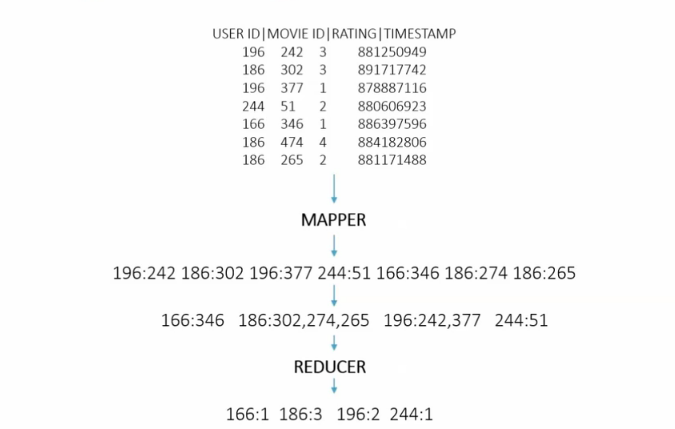

# Big Data with Hadoop 

<ul>
  <li><a href="#mapreduce">Map Reduce</a></li>
  <li><a href="#other">Other tools soon...</a></li>

</ul>

<h1 id="mapreduce">Map Reduce</h1>
<h3 id="example1">Total movies rated by user</h3>
<p>In this example we're trying to get all movies rated by each user using <a href="http://grouplens.org/datasets/movielens/"> movielens</a> dataset</p>


```python
from mrjob.job import MRJob

class MovieByUserCounter(MRJob):
  def mapper(self, key, line):
    (userID, movieID, rating, timestamp) = line.split('\t')
    yield userID, movieID

  def reducer(self, user, movies):
    numMovies = 0
    for movie in movies:
      numMovies = numMovies + 1

    yield user, numMovies

if __name__ == '__main__':
  MovieByUserCounter.run()
```

<h1 id="other">Other tools soon...</h1>